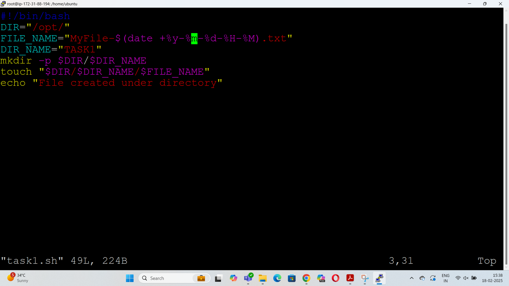
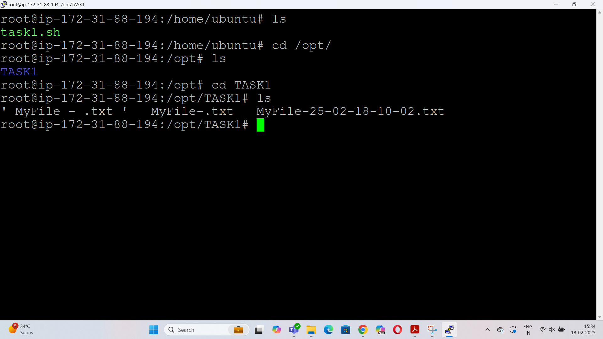

how to create password for the user?
using below command:
passwd username

what is the difference between adduser and useradd?
useradd is a basic, low-level command that adds a user but does not create a home directory by default or prompt for details.
adduser is a user-friendly script that guides you through user creation, including setting a password and creating a home directory.

