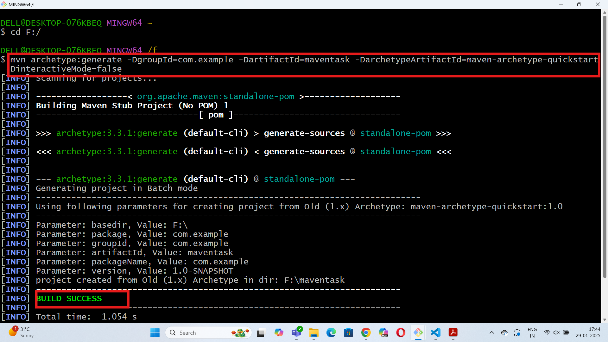
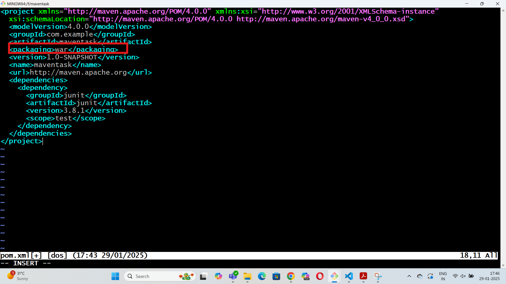
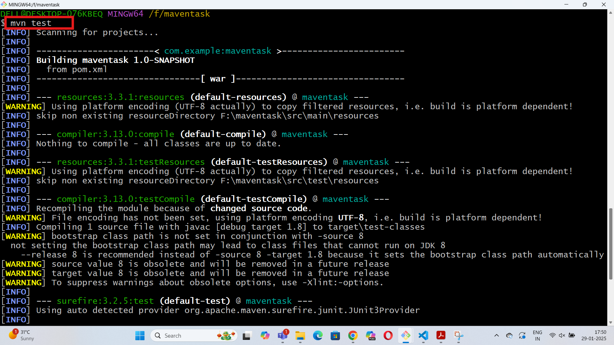
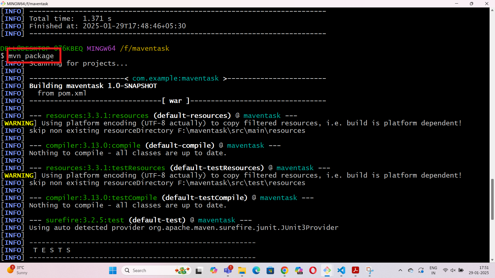
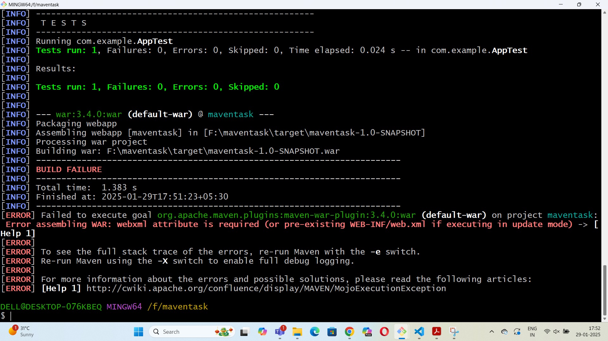
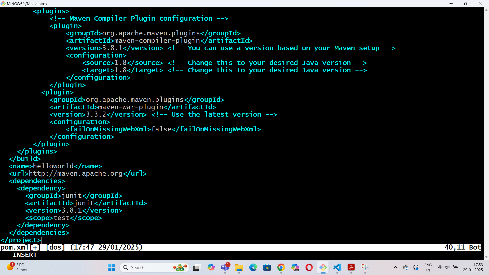
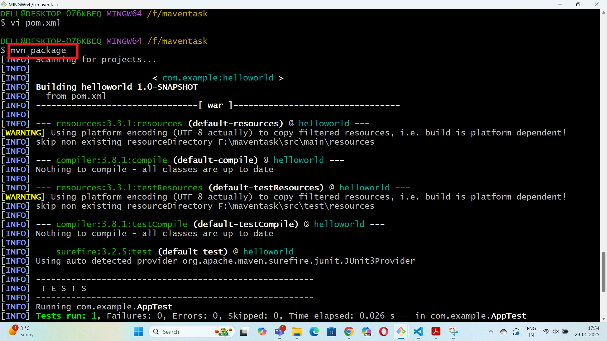
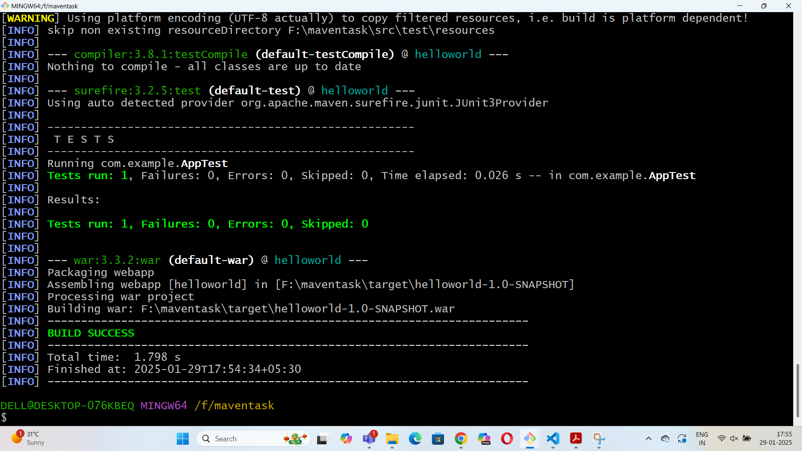
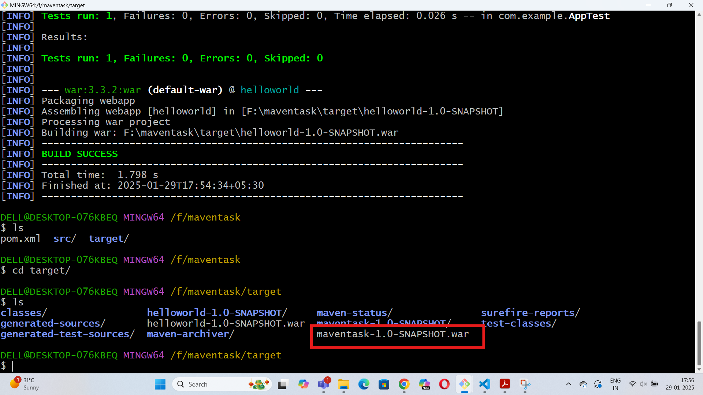

# Maven Task

### Step1: Creating a project using maven

mvn archetype:generate -DgroupId=com.example -DartifactId=maventask -DarchetypeArtifactId=maven-archetype-quickstart -DinteractiveMode=false

### Step2: Edit pom.xml file

### Step3: Implement maven life cycle phases

### Step3: Add war plugin in pom.xml file

### Step4: Implement mvn package phase directly and generate .war file with build success

